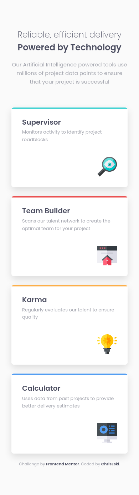

# Frontend Mentor - Four card feature section solution

This is a solution to the [Four card feature section challenge on Frontend Mentor](https://www.frontendmentor.io/challenges/four-card-feature-section-weK1eFYK). Frontend Mentor challenges help you improve your coding skills by building realistic projects.

## Table of contents

- [Overview](#overview)
  - [The challenge](#the-challenge)
  - [Screenshots](#screenshot)
  - [Links](#links)
- [My process](#my-process)
  - [Built with](#built-with)
  - [What I learned](#what-i-learned)
  - [Continued development](#continued-development)
  - [Useful resources](#useful-resources)
- [Author](#author)

## Overview

### The challenge

Users should be able to:

- View the optimal layout for the site depending on their device's screen size

### Screenshots

### Links

- Solution URL: [GitHub repo](https://github.com/ChrisEski/fem-four-card-feature)
- Live Site URL: [https://fem-four-card.netlify.app/](https://fem-four-card.netlify.app/)

## My process

### Built with

- Semantic HTML5 markup
- BEM Naming
- CSS Grid
- Mobile-first workflow

### What I learned

During this challenge i had the opportunity to work on CSS Grid right on the project, and not just as part of a tutorial. How usefull CSS Grid could be was really clear.

### Continued development

On following projects that require CSS Grid i will try to minimize the amount of grid code to the absolute necessary. This, i believe, will make me understand more of what's going on with grid system.

### Useful resources

- [A Complete Guide to Grid (https://css-tricks.com/)](https://css-tricks.com/snippets/css/complete-guide-grid/) - Amazing website, and also amazing article which cover's maybe everything about CSS Grid and it's properties with very comprehensive examples. Strongly recommended for anyone, beginner or not!

## Author

- Frontend Mentor - [ChrisEski](https://www.frontendmentor.io/profile/ChrisEski)
- Github - [ChrisEski](https://github.com/ChrisEski)
- Twitter - [ChrisEski91](https://twitter.com/ChrisEski91)
